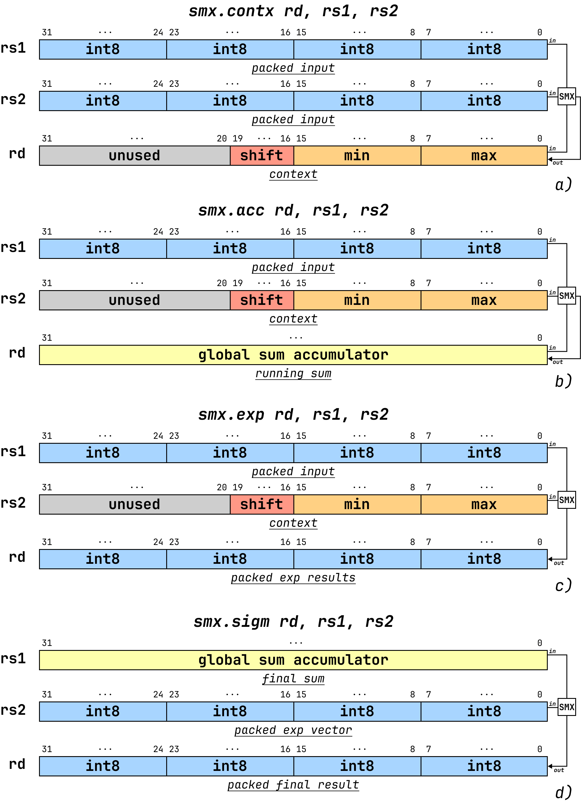
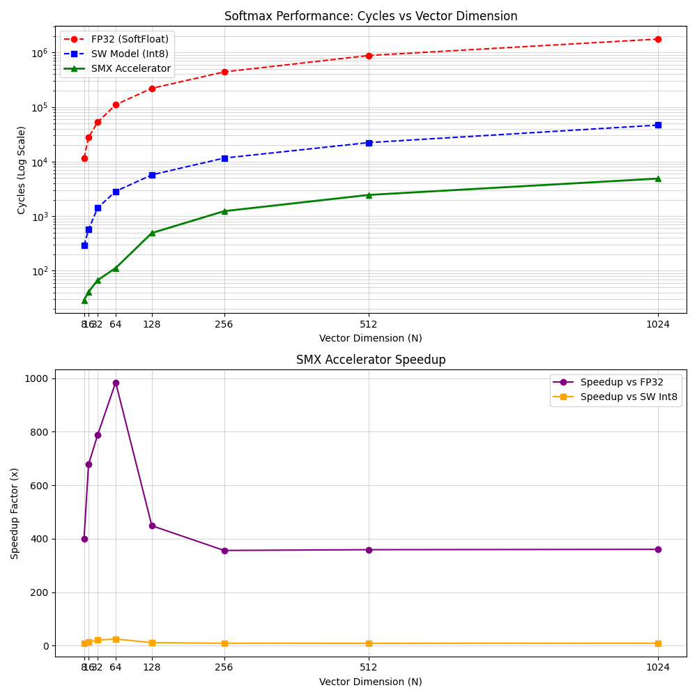

# SMX: A RISC-V ISA Extension for Scale-Adaptive Quantized Softmax

This repository contains the RTL, firmware benchmarks, validation scripts, and a docker container for envirorment reproducibility for **SMX**, a custom softmax extension integrated into the **OpenHW Group CV32E40P** core.

SMX targets **INT8 softmax acceleration on scalar RISC-V processors** through a tightly coupled hardware-software co-design:

- an **adaptive 2D LUT softmax algorithm** that compensates for runtime scale mismatch,
- a compact ISA extension with four custom instructions on packed `int8` data,
- a dedicated functional unit integrated in the `EX` stage of the core.

## Highlights

- **Adaptive quantized softmax** without requiring the input quantization scale to be known a priori.
- **Four custom RISC-V instructions**: `SMX.CONTX`, `SMX.ACC`, `SMX.EXP`, `SMX.SIGM`.
- **Packed INT8 execution** on standard 32-bit scalar registers (`4 x int8` per register).
- **RTL integration in CV32E40P**, with unit-level and full-core simulation flows.
- **Up to 984x speedup** over a software FP32 baseline and **more than 25x** over a software-only INT8 implementation for short vectors.

## ISA Extension

| Instruction | Role | Input / output model |
| --- | --- | --- |
| `SMX.CONTX` | Computes and updates `max`, `min`, and adaptive `shift` | read-modify-write context register |
| `SMX.ACC` | Accumulates quantized exponentials into the denominator sum | packed `int8` input + context -> 32-bit accumulator |
| `SMX.EXP` | Produces packed quantized exponentials | packed `int8` input + context -> packed `int8` result |
| `SMX.SIGM` | Produces packed softmax outputs from exponentials and sum | sum accumulator + packed exponentials -> packed `int8` result |

<br>

All four instructions use the `CUSTOM0` opcode space and R-type encoding.

<br>

<p align="center">
  
</p>

## Architecture Overview

The adaptive softmax flow is split into three hardware-visible phases:

1. `SMX.CONTX`: reduce the input stream to compute `max`, `min`, and the adaptive shift.
2. `SMX.ACC`: evaluate quantized exponentials and accumulate the global normalization sum.
3. `SMX.EXP` + `SMX.SIGM`: produce packed exponentials and final softmax outputs through LUT lookups.

This phase decomposition keeps loop structure and memory traversal in software while exposing the expensive softmax steps as first-class instructions.

<br>

<p align="center">
  
</p>

A pseudocode implementation of the softmax computation can be found in SMX_dev/pseudocode/software_ex.asm

## Repository Layout

| Path | Contents |
| --- | --- |
| `rtl/` | Main CV32E40P RTL, including the SMX integration |
| `example_tb/core/` | Active full-core Verilator flow, bare-metal firmware, benchmark programs, and performance sweep scripts |
| `SMX_dev/src/` | Standalone SMX functional-unit flow for unit-level RTL simulation and LUT generation |
| `SMX_dev/lut_validation/` | Python scripts and LUT files used to validate the adaptive softmax approximation algorithm|
| `SMX_dev/pseudocode/` | Reference pseudocode and assembly sketches for the SMX software flow |
| `docker/` | Recommended execution environment: Dockerfile, Python requirements, toolchain wrapper, and container launcher |
| `docs/` | Documentation sources for the CV32E40P base core |

## Quick Start

The recommended way to install the dependencies and run the repository is through the Docker container in [`docker/`](./docker). The container already includes Verilator, the RISC-V toolchain, and the Python dependencies used by the validation and benchmark scripts.

All commands below assume you start from the repository root and that you have docker installed on your system.

### 1. Use the prebuilt container image

Pull the latest image published on GitHub Container Registry:

```bash
docker pull ghcr.io/lucacris72/smx:latest
```

Open an interactive shell inside the published container:

```bash
./docker/shell.sh
```

You can also execute a single command without entering an interactive shell:

```bash
./docker/shell.sh bash -lc 'cd example_tb/core && make hello-world-run'
```

The launcher checks for the local image `smx-test-env:local` first. If it is not available, it automatically falls back to `ghcr.io/lucacris72/smx:latest`. You can still override the image explicitly with `SMX_DOCKER_IMAGE=...`.

### 2. Build the container locally instead

If you prefer to rebuild the environment locally, build the image from `docker/`:

```bash
docker build -t smx-test-env:local docker
```

Open an interactive shell inside the container:

```bash
./docker/shell.sh
```

You can also execute a single command without entering an interactive shell:

```bash
./docker/shell.sh bash -lc 'cd example_tb/core && make hello-world-run'
```

### 3. Run the main flows inside the container

The commands below assume you are already inside the container shell started with `./docker/shell.sh`.

Unit-level SMX RTL simulation:

```bash
cd SMX_dev/src
make TOP=tb_smx_fu_lut sim
```

Other focused testbenches are also available:

```bash
make TOP=tb_smx_fu_lut_max sim
make TOP=tb_smx_fu_lut_acc sim
make TOP=tb_smx_fu_lut_exp sim
make TOP=tb_smx_fu_lut_sigm sim
```

Full-core simulation on CV32E40P:

```bash
cd example_tb/core
make hello-world-run
```

Performance sweep used to generate the softmax scaling plot:

```bash
python3 run_performance_sweep.py
```

Single comparison run for the full benchmark:

```bash
make custom/softmax_comparison.elf
make softmax-comparison-run
```

## Local Setup Without Docker

If you prefer to run everything directly on the host, install the required system packages, create a Python virtual environment, and build the RISC-V toolchain locally.

These instructions have been tested on Ubuntu 24.04.

### 1. System packages

The following system packages are required:

```bash
sudo apt-get update
sudo apt-get install -y \
  python3-venv autoconf automake autotools-dev curl python3 python3-pip \
  python3-tomli libmpc-dev libmpfr-dev libgmp-dev gawk build-essential \
  bison flex texinfo gperf libtool patchutils bc zlib1g-dev libexpat-dev \
  ninja-build git cmake libglib2.0-dev libslirp-dev libncurses-dev verilator
```

### 2. Python virtual environment

The Python dependencies used by the local scripts are listed in [`requirements.txt`](./requirements.txt):

```bash
python3 -m venv .venv
source .venv/bin/activate
python -m pip install --upgrade pip setuptools wheel
python -m pip install -r requirements.txt
```

### 3. Build the RISC-V toolchain

For the RISC-V toolchain, follow the official instructions in the [`riscv-gnu-toolchain`](https://github.com/riscv-collab/riscv-gnu-toolchain) repository and build the Newlib toolchain for the target used by this project.

The local flow expects an ELF bare-metal toolchain configured for:

- `--with-arch=rv32gc_zicsr`
- `--with-abi=ilp32`

```bash
mkdir -p toolchain/riscv
cd toolchain/riscv
git clone https://github.com/riscv-collab/riscv-gnu-toolchain.git
cd riscv-gnu-toolchain
./configure --prefix="$(pwd)/../install" \
  --disable-linux \
  --disable-multilib \
  --disable-gdb \
  --with-arch=rv32gc_zicsr \
  --with-abi=ilp32
make -j"$(nproc)"
```

Then export the installation path so the build system can find the compiler:

```bash
export RISCV="$(pwd)/../install"
```

### 4. Run the flows on the host

Once the dependencies are installed and `RISCV` points to the local toolchain, you can run the same commands shown in the container quickstart:

```bash
cd example_tb/core
make hello-world-run
python3 run_performance_sweep.py
```

## Performance Summary

The paper evaluates three implementations:

- **Software FP32**: reference softmax using floating-point operations,
- **Software INT8**: integer-only LUT-based model,
- **SMX HW**: custom instruction flow on the integrated accelerator.

Representative cycle counts from the report are shown below:

| Vector size `N` | FP32 cycles | SW INT8 cycles | SMX HW cycles | Speedup vs FP32 | Speedup vs SW INT8 |
| --- | ---: | ---: | ---: | ---: | ---: |
| 8 | 11,623 | 290 | 29 | 400x | 10.0x |
| 64 | 110,276 | 2,851 | 112 | 984x | 25.4x |
| 1024 | 1,759,547 | 46,639 | 4,882 | 360x | 9.6x |

<p align="center">
  
</p>

For larger vectors, the speedup is still substantial, but loop-control overhead starts to dominate because the SMX unit itself sustains very high throughput.

## Paper Results Reproducibility

This section summarizes the scripts used to reproduce the main numerical and performance results reported in the project report. The commands below assume you already completed the Docker-based quickstart and built the container image.

### 1. Numerical validation and plots

The LUT validation flow in `SMX_dev/lut_validation/` reproduces the numerical analysis behind the adaptive softmax approximation, including the results discussed in Tables 1 and 2 and the rank-ordered plots corresponding to Figures 3 and 4.

Run it inside the container from the repository root:

```bash
./docker/shell.sh bash -lc 'cd SMX_dev/lut_validation && python3 softmax_lut_validation.py'
```

The script:

- prints aggregate metrics for the standard LUT method, the adaptive method, and quantization baselines,
- generates `smx_lut1d.hex` and `smx_lut2d.hex`,
- saves the comparison plots under `SMX_dev/lut_validation/plots_softmax_compare/`.

If you want to change the validation workload, the script also exposes parameters such as `--num-vecs`, `--vec-len`, `--scale`, `--lut1-size`, `--lut2-rows`, and `--lut2-cols`.

Example:

```bash
./docker/shell.sh bash -lc "cd SMX_dev/lut_validation && python3 softmax_lut_validation.py --num-vecs 200 --vec-len 64 --scale 0.5"
```

### 2. Full-core benchmark sweep

The cycle counts summarized in Table 3 are reproduced by the full-core benchmark flow in `example_tb/core/`. The sweep recompiles `custom/softmax_comparison.c` for multiple vector sizes, runs the RTL simulation, extracts the cycle counts printed by the benchmark, and generates a CSV file and a plot.

Run:

```bash
./docker/shell.sh bash -lc 'cd example_tb/core && python3 run_performance_sweep.py'
```

The script produces:

- terminal output with `FP32`, `SMX`, and `SW Model` cycle counts for each tested `N`,
- `example_tb/core/softmax_performance.csv`,
- `example_tb/core/softmax_performance.png`.

### 3. Single benchmark run

If you want to inspect one benchmark execution before running the full sweep, you can launch the standalone comparison program directly:

```bash
./docker/shell.sh bash -lc "cd example_tb/core && make -B custom/softmax_comparison.hex CUSTOM_GCC_FLAGS='-DN=64' && make softmax-comparison-run"
```

You can choose the vector dimension by changing the `-DN=64` compile-time parameter to the desired length.

This is useful to verify the simulator output format and inspect the raw cycle counts for a specific vector size.

## Reference

If you use or extend this repository, cite the accompanying report:

**Luca Donato, Tommaso Spagnolo, Cristina Silvano.**
*SMX: A RISC-V ISA Extension for Scale-Adaptive Quantized Softmax.*
